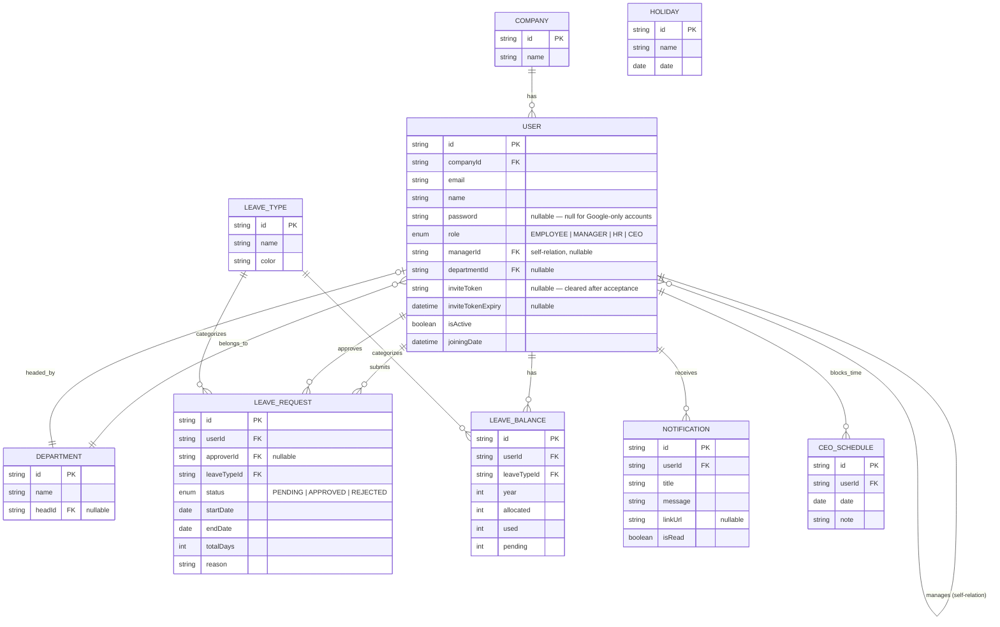

# Architecture — LeaveLedger

## Data Model

See [`prisma/schema.prisma`](../prisma/schema.prisma) for the full, authoritative schema.

---

## Authentication & Authorization

**Two sign-in methods, one session shape:**

- **Credentials** — email + bcrypt-hashed password.
- **Google OAuth** — registered as two separate provider instances (`google-login` and `google-register`) so the server can distinguish which button was clicked:
  - **Login flow** — only accepts an existing account. An unrecognized Google email returns `false` from the `signIn` callback, redirecting to `/login?error=AccessDenied` with a clear "no account found" message.
  - **Register flow** — allows a new email to proceed to a short company-name step (`/register/google`), authenticated by a short-lived `jose`-signed token, then creates the `Company` + `CEO` row.

**Session integrity:** Every JWT session carries `id`, `role`, `departmentId`, and `companyId`. On every read — not just at sign-in — the `session` callback re-queries the database to confirm the user still exists and is active. Deleting or deactivating a user invalidates their session immediately instead of waiting for JWT expiry. `proxy.ts` enforces route protection on every request.

**Invite flow (new user email verification):**

1. HR/Manager/CEO submits an email in the User Directory.
2. A `User` row is created `isActive: false` with a random `inviteToken` (48-hour expiry).
3. An email is sent via Resend to the invite link `/accept-invite?token=...`. Locally without a `RESEND_API_KEY`, the link is logged to the server console so the flow is fully testable without a mail account.
4. The invited person sets their own password at that link — this is the email-reachability proof — and the account activates (`isActive: true`, `inviteToken` cleared).

---

## Role & Permission Matrix

| Action | Employee | Manager | HR | CEO |
| --- | :---: | :---: | :---: | :---: |
| View own leave / apply for leave | ✅ | ✅ | ✅ | ✅ |
| View User Directory | ❌ | Employees only | Manager + Employee | Everyone |
| Add user (invite) | ❌ | Employee only | Manager or Employee | Anyone |
| Edit user | ❌ | Employees only | Manager + Employee | Anyone |
| Delete / deactivate user | ❌ | Employees only | Manager + Employee | Anyone |
| Review & approve leave | ❌ | Employees only | Manager + Employee | Manager + HR |
| Manage company holidays | ❌ | ❌ | ✅ | ✅ |
| Manage CEO schedule | ❌ | ❌ | ❌ | ✅ |

Each permission is enforced **twice**: once in the UI (hiding disallowed actions) and once in the corresponding API route (rejecting the request even if the UI check is bypassed).

---

## Multi-Tenancy

`/register` (email/password or Google) always creates a new `Company` and its first user as `CEO` — no other role can be created through that public endpoint. Every subsequent account is created by an already-authenticated user via the invite flow, which always stamps the new user with the **creator's** `companyId`. A `companyId` sent from the client is never trusted.

**Cascade behavior:** Deleting a `User` cascades to their own leave requests, balances, notifications, and schedules, and nullifies `managerId`, `approverId`, and `Department.headId` where referenced — so removing a manager or approver never produces a foreign-key error.

### Known Limitations

`Department`, `LeaveType`, and `Holiday` are currently **shared across all companies** (not company-scoped). For a demo project this keeps the data model simpler, but a production SaaS would scope these too. This is the top roadmap item if the project continues past the trial.

---

## API Endpoints

All routes require an authenticated session unless marked **Public**. Role requirements are enforced server-side.

### Auth

| Method | Path | Auth | Description |
| --- | --- | --- | --- |
| `POST` | `/api/auth/register` | Public | Creates a new Company + CEO account (email/password) |
| `POST` | `/api/auth/register-google` | Public (jose token) | Creates a new Company + CEO account after Google OAuth |
| `POST` | `/api/auth/accept-invite` | Public (invite token) | Sets password and activates an invited user's account |
| `GET/POST` | `/api/auth/[...nextauth]` | — | Auth.js catch-all handler (sign in, sign out, session) |

### Users

| Method | Path | Auth | Description |
| --- | --- | --- | --- |
| `GET` | `/api/users` | Manager / HR / CEO | Returns the scoped user list (filtered by role visibility rules) |
| `POST` | `/api/users` | Manager / HR / CEO | Creates a new user and sends an invite email |
| `PATCH` | `/api/users` | Manager / HR / CEO | Updates a user (name, role, department, manager, active state) |
| `DELETE` | `/api/users` | Manager / HR / CEO | Deletes a user (cascades per schema rules) |

### Leave

| Method | Path | Auth | Description |
| --- | --- | --- | --- |
| `POST` | `/api/leave/apply` | Any authenticated | Submits a new leave request; debits pending balance |
| `POST` | `/api/leave/cancel` | Any authenticated | Cancels own pending leave request; restores pending balance |

### Approvals

| Method | Path | Auth | Description |
| --- | --- | --- | --- |
| `POST` | `/api/approvals` | Manager / HR / CEO | Approves or rejects a leave request; updates balances and creates a notification |

### Holidays

| Method | Path | Auth | Description |
| --- | --- | --- | --- |
| `GET` | `/api/holidays` | Any authenticated | Lists all company holidays |
| `POST` | `/api/holidays` | HR / CEO | Creates a new holiday |
| `DELETE` | `/api/holidays` | HR / CEO | Deletes a holiday by ID |

### CEO Schedule

| Method | Path | Auth | Description |
| --- | --- | --- | --- |
| `GET` | `/api/ceo-schedule` | Any authenticated | Lists CEO schedule blocks |
| `POST` | `/api/ceo-schedule` | CEO | Creates a new schedule block |
| `DELETE` | `/api/ceo-schedule` | CEO | Deletes a schedule block by ID |

### Profile

| Method | Path | Auth | Description |
| --- | --- | --- | --- |
| `PATCH` | `/api/profile` | Any authenticated | Updates own name, phone, or avatar |

### Notifications

| Method | Path | Auth | Description |
| --- | --- | --- | --- |
| `PATCH` | `/api/notifications` | Any authenticated | Marks one or all notifications as read |

---

## Key Trade-offs

- **No department-level per-company customization (yet)** — traded off to ship the higher-value user/request/approval isolation first, since that's where real data-privacy risk lives.
- **Approvals scope is role-based, not strictly "direct manager only"** — HR can review any Manager or Employee's request; CEO reviews any Manager or HR request. This matches how small-to-mid-size companies actually delegate approval authority rather than enforcing a rigid one-level-up chain.
- **Invite-based email verification over a raw deliverability check** — requiring the invited person to click a link and set a password is the standard, legitimate way to prove an email is real and reachable. A raw "can we ping this address?" check is unreliable and often flagged as abusive by mail providers.
- **JWT sessions with per-request DB verification** — trades a small per-request DB hit for instant session invalidation when a user is deleted or deactivated, which matters in a multi-tenant HR tool.
